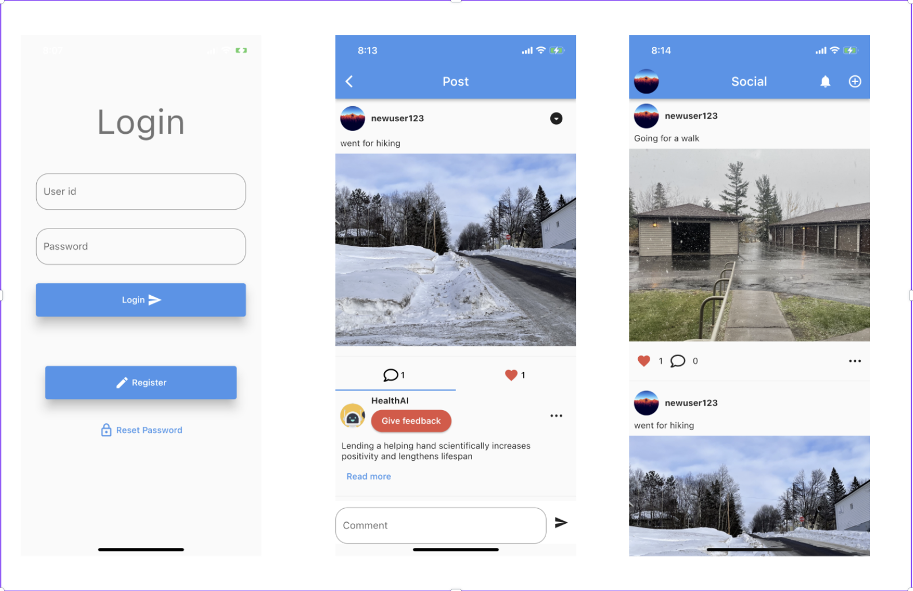

# FreeMind

FreeMind is a mobile application designed to address the mental health challenges faced by college students, especially in the wake of the COVID-19 pandemic. Recognizing the heightened stress and emotional health decline among students, FreeMind aims to provide a supportive platform for social interaction and personalized well-being recommendations.

## Getting Started

Step 1: Run FreeMind API on port 8000 - [link](https://github.com/kazifarhan199/FreeMind-API)

Step 2: Install dependencies flutter pub get

Step 3: Run App flutter run

## Interface

## More details

For more details you can please take a look at the links bellow.

Presentations: https://www.canva.com/design/DAGE8tyBM6o/UZTTgef_ZA6XtsML222s6g/edit?utm_content=DAGE8tyBM6o&utm_campaign=designshare&utm_medium=link2&utm_source=sharebutton

Journal(Smart health): https://scholar.google.com/citations?view_op=view_citation&hl=en&user=fAqtNUIAAAAJ&citation_for_view=fAqtNUIAAAAJ:u5HHmVD_uO8C
